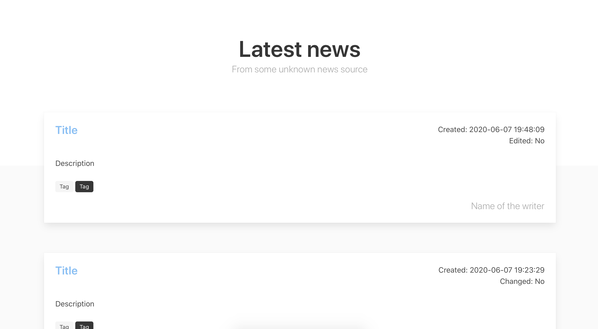
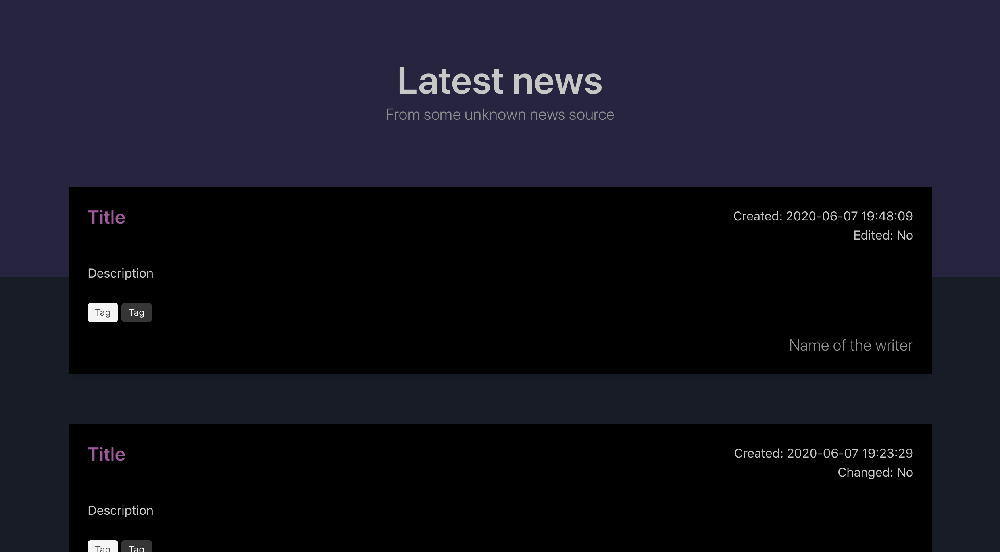

# News

Static website to display the latest news.

<hr>

The latest data is fetched & parsed in real time.
The website automatically switches between dark & light mode depending on your preferred settings.

## Getting started

### Requirements

[Npm](https://nodejs.org) is required

### Install

```shell
yarn
```

## Commands

### Run the dev environment with watch mode on

`yarn run dev`

### Bundle to production

`yarn run prod`

### Bundle & release to production

`yarn run release`

### Lint your code

`yarn run lint`

## Contributing

Pull requests are welcome.

## License

[GNU GPLv3](https://choosealicense.com/licenses/gpl-3.0/)

## Screenshots



